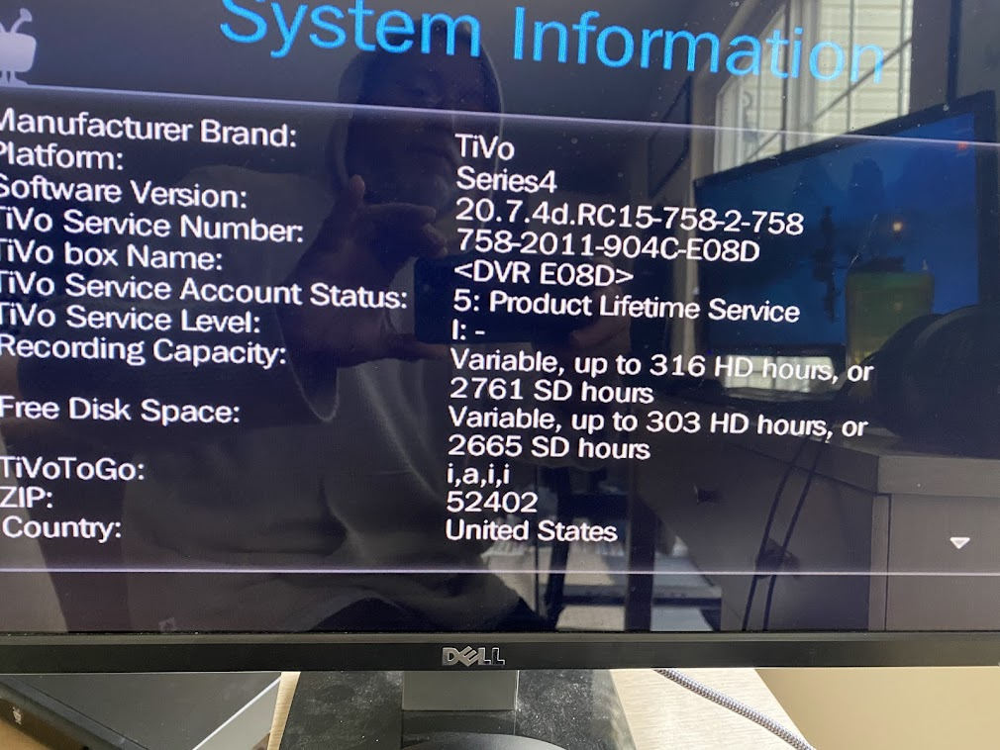
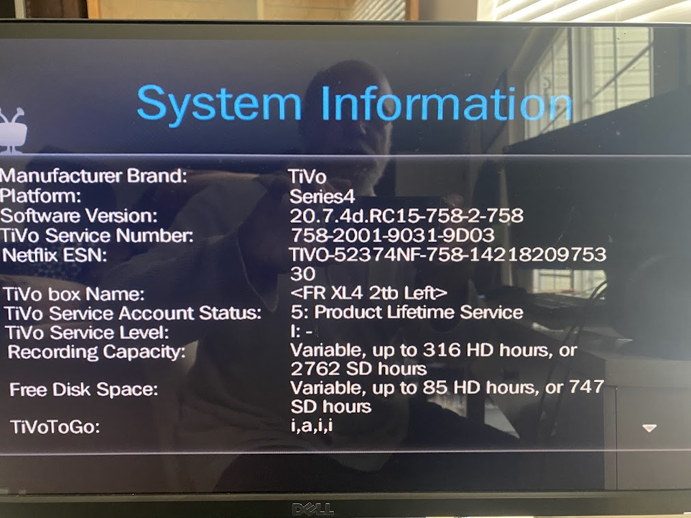

# tivo

Hello Larry

This is Chris Trees (the guy who bought the old TIVO's).  We got two of them registered to Steve last June.  We were hooking up the other two and called in to Tivo to change them and Tivo says now they 'require' a service request code from you before they move them to Steve's Tivo account.

- Call TiVo Customer Support 877.367.8486
- Ask the AI to talk to an Agent
  - REASON: Transfer ownership of Tivo
- Get an authorization case number for the following TiVos
  - TiVo Premiere XL4 758-2011-904C-E08D
  - TiVo Premiere XL4 758-2001-9031-9D03
- Text the case number to me

<!--
## TiVo Transfer 
- Take picture of System Information screen TiVo Service Number
- Go to [TiVo.com](https://www.tivo.com/)
- Login email / C1!
- Go to Manage Devices to see current TiVo list
- Call TiVo Customer Support 877.367.8486
- Ask the AI to talk to an Agent to Transfer an old TiVo 758-2001-902D-BB5D
- June 30th Transfer Need to have the seller create a case number to do the transfer.
- All-In Plan Service
- You may transfer ownership of ANY TiVo device with All-in Plan (formerly known as Product Lifetime Service) as long as the subscription is not a Free Temporary TiVo Service. This includes legacy boxes (Series 1 - Series 4), Roamio Series, BOLT Series and EDGE Series.
- I am the ORIGINAL owner
  1. Before you transfer your device with All-in-Plan, login to your account online and check the payment plan. If the payment plan shows TiVo Lifetime Service, proceed to transfer the ownership of your device.
  2. Contact Tivo Support and get an Authorization Case Number.
  3. Once you have the case number, provide the case number to the new owner and ask to contact TiVo Support.
  4.
- I am the NEW owner
  1. You must secure the Authorization Case Number from the original owner of the device to transfer the device to your account.
  2. Once you have the case number, contact Tivo Support.
  3. You can sign in to My Account to check or update your account information. Create an account if you do not have an account yet.
  4. Applicable TiVos TiVo Premiere XL4 758-2011-904C-E08D - TiVo Service Number
-->
---

# Photos

---
## Timeline
- April ? Steve found listing
- April 30 Chris contact Larry via FB Marketplace
- May 3 Chris goes picks up Larry FB phone and address
- June 15 Chris goes to Steve's
- June 30 ?? Steve transfers
- Dec 29 ?? Steve rejected transfer
- Dec 30 ?? last attempt before contacting Larry

---

## Tivo to media
- [pyTivo post](https://www.tivocommunity.com/threads/is-there-a-way-to-upload-videos-to-a-tivo.595329/page-2?post_id=12944169#post-12944169)

<!--
Hello Larry

This is Chris Trees (the guy who bought the old TIVO's).  We got two of them registered to Steve last June.  We were hooking up the other two and called in to Tivo to change them and Tivo said they 'require' a service request code from you before they move them to Steve's Tivo account.

- Tivo Service Number to call:  (xxx) xxx.xxxx
- Request "Authorization to release registered tivo to new owner."
- Tivo ID: xxxx
- Tivo ID: xxxx
Larry 3903 Sally Drive NE, Cedar Rapids, Iowa
Larry 319-213-6199
-->

- Chris Trees    christrees@gmail.com  (515) 999-0007
- Steve Edwards  gus@conversehouse.com (314) 853-8397
